# Creating an ETL Pipeline with Amazon EMR and Apache Spark (using PySpark)

In this tutorial, you learned about how you can build an ETL (Extract, Transform, and Load) pipeline for batch processing using Amazon EMR and Spark. During this process we will also learn about few of the use case of batch ETL process and how EMR can be leveraged to solve such problems. 

We are going to use [PySpark](https://spark.apache.org/docs/latest/api/python/) to intract with the Spark cluster. PySpark allows you to write Spark applications using Python APIs. 

## Requirements 

We assume that you have the following:

- An AWS account 
- An IAM user that has the access to create IAM role, which will be used to trigger or execute the Spark job 
- Basic understanding of Python


## Use case and problem statement

For this tutorial, let's assume you have a vendor who provides incremental sales data at the end of every day. And the file arrives in S3 as `CSV` and it needs to be processed and made available to your data analysts for querying. 

We need to build a data pipeline such that it automatically picks up the new sales file from the S3 input bucket, processes it with required transformations, and makes it available in the target S3 bucket, which will be used for querying. 


## Architecture 

To implement this pipeline, you have planned to integrate a transient EMR cluster with Spark as the distributed processing engine. This EMR cluster is not active and gets created just before executing the job and gets terminated after completing the job.

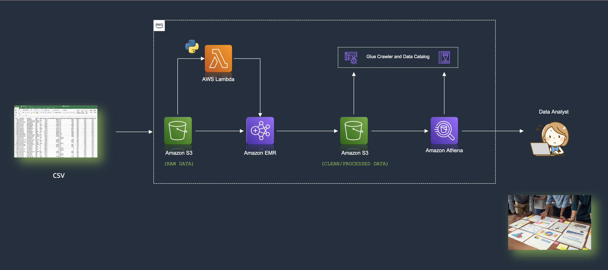

## Create an EMR Cluster

Before we create an EMR cluster we need to create an `Key Pair`, which we would need to access the EMR cluster's master node. So, lets create that first 

1. Once you are in the EC2 console, click on **Key Pairs** option on the left menu bar. And click on `Create Key Pair` 

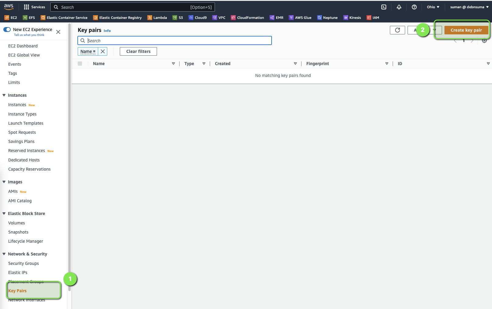

2. Provide the key pair name and create an Key Pair. 

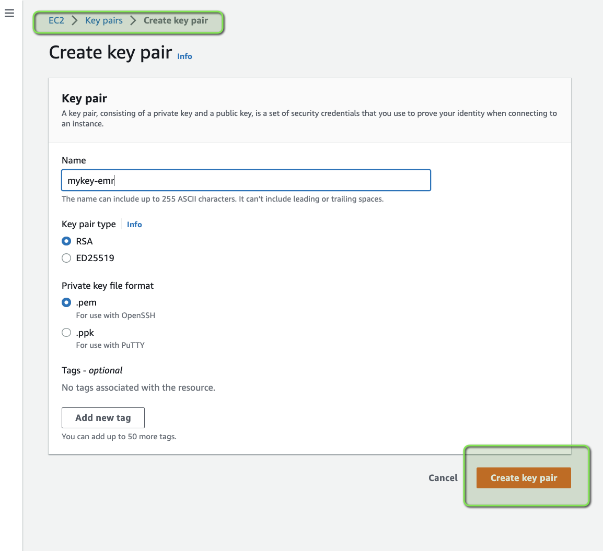

3. Now, we can open the Amazon EMR console and click on **Create Cluster** to create an EMR cluster

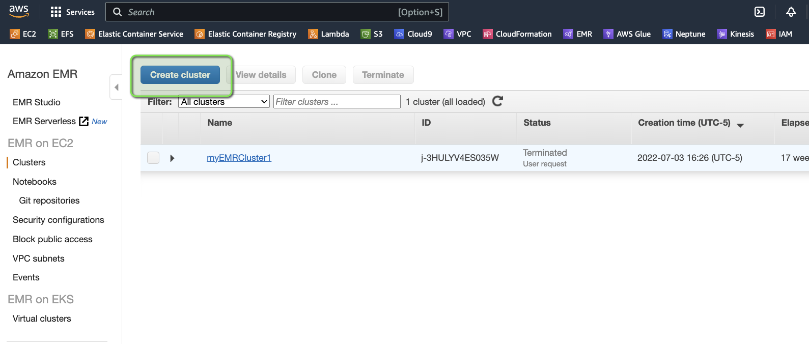

4. We can provide some name to our EMR cluster, select the following:
    - Select the **latest release** of EMR under **Software configuration** section
    - Select **Spark: Spark 3.3.0 on Hadoop 3.2.1 YARN with and Zeppelin 0.10.1** under **Application** section, 
    - Select the right **EC2 key pair** (which you created in the previous step) under the **Security and access** section 

   Keep everything else as default and click on **Create cluster** 

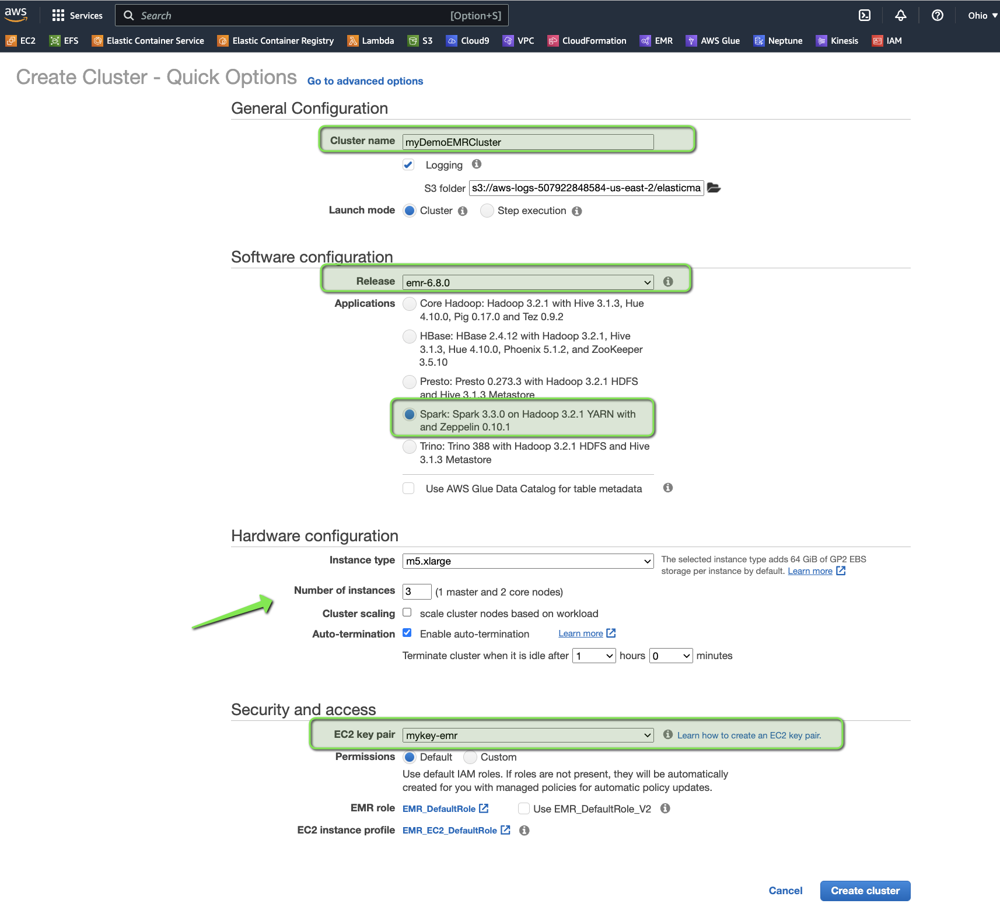

5. Cluster creation would take some time, and after couple of minutes, you will see that the cluster is **up and running** with a state of `Waiting` 

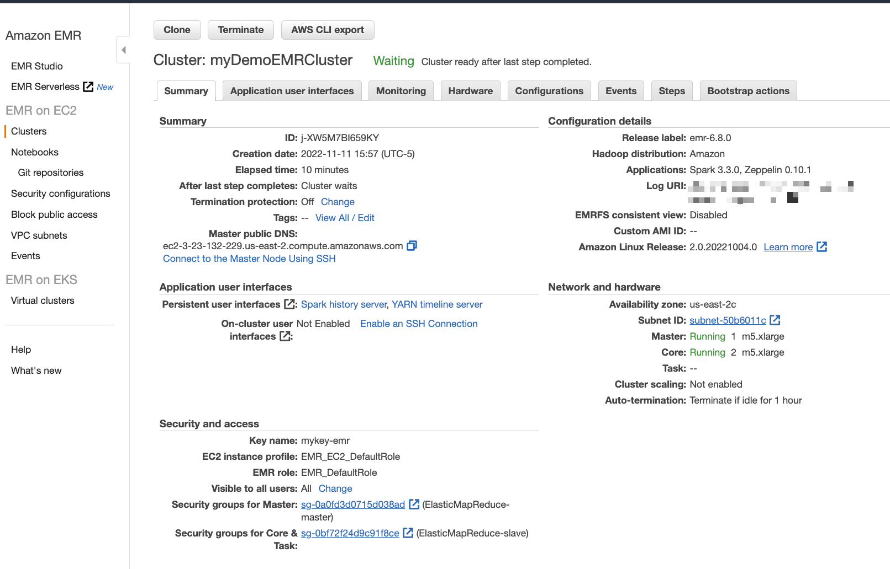

## Create Amazon S3 bucket

First create the Amazon S3 buckets and folders that will be used for both `RAW` and `CLEANSED` data

1. Navigate to the Amazon S3 console and click on **Create Bucket** 

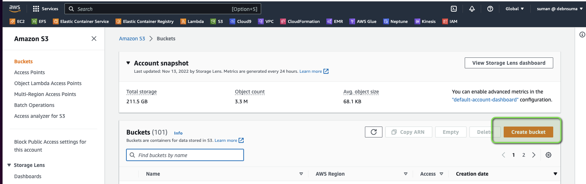

2. Create a bucket (e.g. `etl-batch-emr-demo`) 

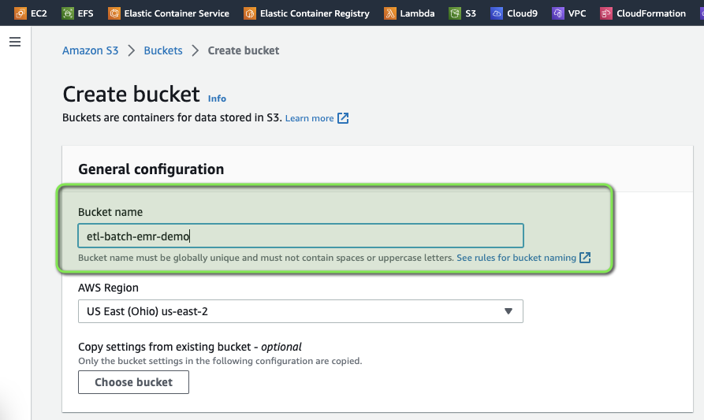

3. Once the bucket is created, create two sub-folders namely 
    - `cleaned_data`
    - `raw_data`

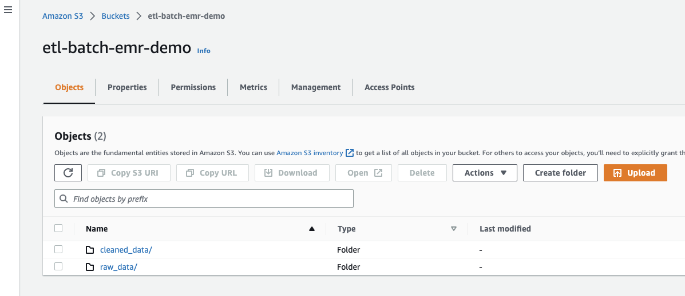

4. Upload the sales dataset in the bucket under the folder `cleaned_data`

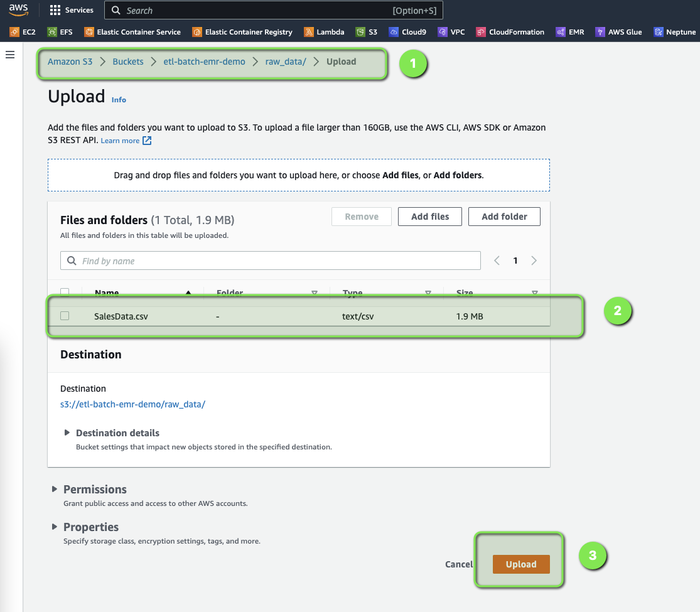

## Submit the PySpark job 

Now, that we have the dataset uploaded in S3, its time to submit the PySpark job. 

1. From the EMR console, select the EMR cluster which you created in earlier and click on **Connect to the Master Node Using SSH** 

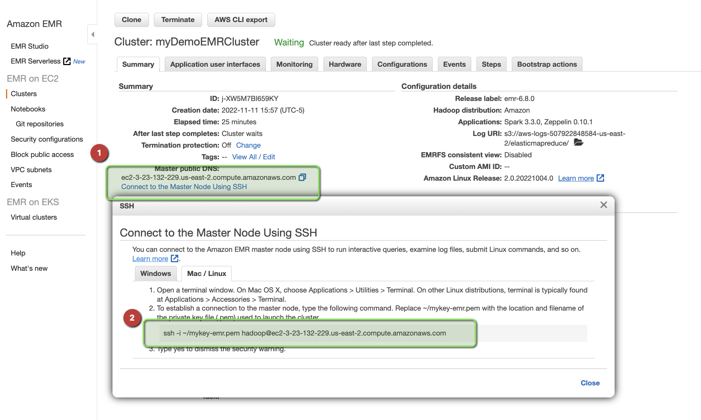

2. SSH to the EMR cluster's Master node 

3. Copy the PySpark code (`etl-job.py`) from [here](TBA) and save it in the Master Node and make the following changes and save the file:

    - `S3_INPUT_DATA`  = '<YOUR_BUCKET_LOCATION_OF_RAW_DATA>'
    - `S3_OUTPUT_DATA` = '<YOUR_BUCKET_LOCATION_OF_CLEANED_DATA>'

```python

from pyspark.sql import SparkSession
from pyspark.sql import functions as F

S3_INPUT_DATA = '<YOUR_BUCKET_LOCATION_OF_RAW_DATA>'
S3_OUTPUT_DATA = '<YOUR_BUCKET_LOCATION_OF_CLEANED_DATA>'


def main():

    spark = SparkSession.builder.appName("My Demo ETL App").getOrCreate()
    spark.sparkContext.setLogLevel('ERROR')

    # Spark Dataframe (Raw)- Transformation 
    df = spark.read.option("Header", True).option("InferSchema", True).csv(S3_INPUT_DATA)
    
    replacements = {c:c.replace(' ','_') for c in df.columns if ' ' in c}
    final_df = df.select([F.col(c).alias(replacements.get(c, c)) for c in df.columns])

    print(f"Total no. of records in the source data set is : {final_df.count()}")

try:
    final_df.write.mode('overwrite').parquet(S3_OUTPUT_DATA)
    print('The cleaned data is uploaded')
except:
    print('Something went wrong, please check the logs :P')

if __name__ == '__main__':
    main()

```

4. Submit the PySpark job

```bash
sudo spark-submit etl-job.py 
```

5. Once the job completes, check the S3 bucket under the folder `cleaned_data`, you should see the new transformed data in `parquet` format 

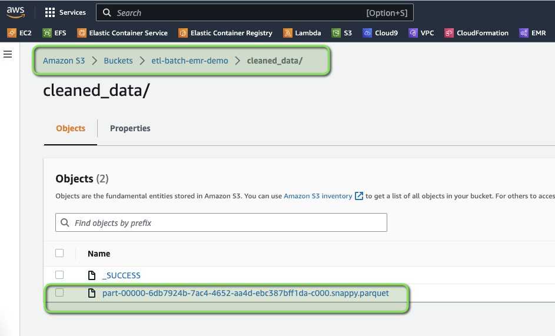

## Validating the output using Amazon Athena

The Parquet format data is already available in Amazon S3 with year and month partition, but to make it more consumable for data analysts or data scientists, it would be great if we could enable querying the data through SQL by making it available as a database table.

To make that integration, we can follow a two-step approach:
1. We can run the Glue crawler to create a Glue Data Catalog table on top of the S3 data.
2. We can run a query in Athena to validate the output

### Creating an AWS Glue Data Catalog

### Querying output data using Amazon Athena standard SQL 

